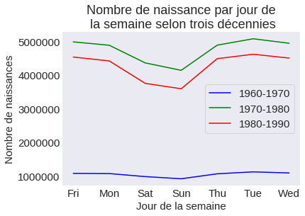

```python
%matplotlib inline
import pandas as pd
import seaborn as sns
import matplotlib.pyplot as plt
plt.style.use('seaborn-dark')
plt.rcParams.update({ 'font.size' : 15, 'xtick.labelsize':15, 'ytick.labelsize':15 })
```


```python
data = pd.read_csv('births.csv')
# remove nan values
data = data.dropna()
# remove lines where day = 99
data = data[data.day != 99]
```


```python
year = pd.cut(data['year'], [1960, 1970, 1980, 1990])
visu = data.pivot_table('births', year, 'month', aggfunc='sum')
visu
```


<div>
<style scoped>
    .dataframe tbody tr th:only-of-type {
        vertical-align: middle;
    }

    .dataframe tbody tr th {
        vertical-align: top;
    }

    .dataframe thead th {
        text-align: right;
    }
</style>
<table border="1" class="dataframe">
  <thead>
    <tr style="text-align: right;">
      <th>month</th>
      <th>1</th>
      <th>2</th>
      <th>3</th>
      <th>4</th>
      <th>5</th>
      <th>6</th>
      <th>7</th>
      <th>8</th>
      <th>9</th>
      <th>10</th>
      <th>11</th>
      <th>12</th>
    </tr>
    <tr>
      <th>year</th>
      <th></th>
      <th></th>
      <th></th>
      <th></th>
      <th></th>
      <th></th>
      <th></th>
      <th></th>
      <th></th>
      <th></th>
      <th></th>
      <th></th>
    </tr>
  </thead>
  <tbody>
    <tr>
      <th>(1960, 1970]</th>
      <td>596016</td>
      <td>552006</td>
      <td>603644</td>
      <td>569490</td>
      <td>587014</td>
      <td>594698</td>
      <td>648514</td>
      <td>652036</td>
      <td>644778</td>
      <td>635762</td>
      <td>606294</td>
      <td>643698</td>
    </tr>
    <tr>
      <th>(1970, 1980]</th>
      <td>2752425</td>
      <td>2553947</td>
      <td>2776784</td>
      <td>2609183</td>
      <td>2710739</td>
      <td>2686452</td>
      <td>2919502</td>
      <td>2979968</td>
      <td>2924062</td>
      <td>2866497</td>
      <td>2696224</td>
      <td>2786956</td>
    </tr>
    <tr>
      <th>(1980, 1990]</th>
      <td>2410724</td>
      <td>2256993</td>
      <td>2487712</td>
      <td>2382230</td>
      <td>2487467</td>
      <td>2477546</td>
      <td>2652279</td>
      <td>2677760</td>
      <td>2637333</td>
      <td>2553113</td>
      <td>2392970</td>
      <td>2473722</td>
    </tr>
  </tbody>
</table>
</div>


```python
date_df = data.loc[:, ['year', 'month', 'day']]
date = pd.to_datetime(date_df, format='%Y-%m-%d', errors='coerce')
```


```python
date_df = date.to_frame()
date_df = date_df.rename(columns={0:"date"})
```


```python
data = data.loc[:, ['gender', 'births']]
data = pd.concat([date_df, data], axis=1)
data['day'] = data['date'].dt.day_name()
```


```python
visu = data.pivot_table('births', year, 'day', aggfunc='sum')
visu
```


<div>
<style scoped>
    .dataframe tbody tr th:only-of-type {
        vertical-align: middle;
    }

    .dataframe tbody tr th {
        vertical-align: top;
    }

    .dataframe thead th {
        text-align: right;
    }
</style>
<table border="1" class="dataframe">
  <thead>
    <tr style="text-align: right;">
      <th>day</th>
      <th>Friday</th>
      <th>Monday</th>
      <th>Saturday</th>
      <th>Sunday</th>
      <th>Thursday</th>
      <th>Tuesday</th>
      <th>Wednesday</th>
    </tr>
    <tr>
      <th>year</th>
      <th></th>
      <th></th>
      <th></th>
      <th></th>
      <th></th>
      <th></th>
      <th></th>
    </tr>
  </thead>
  <tbody>
    <tr>
      <th>(1960, 1970]</th>
      <td>1078904</td>
      <td>1072594</td>
      <td>982794</td>
      <td>918524</td>
      <td>1066176</td>
      <td>1123488</td>
      <td>1090704</td>
    </tr>
    <tr>
      <th>(1970, 1980]</th>
      <td>4982204</td>
      <td>4882617</td>
      <td>4358362</td>
      <td>4137862</td>
      <td>4885094</td>
      <td>5074669</td>
      <td>4941667</td>
    </tr>
    <tr>
      <th>(1980, 1990]</th>
      <td>4532122</td>
      <td>4416584</td>
      <td>3750348</td>
      <td>3590602</td>
      <td>4483536</td>
      <td>4615642</td>
      <td>4501015</td>
    </tr>
  </tbody>
</table>
</div>


```python
visu = visu.rename(columns={'Friday':'Fri',
                            'Monday':'Mon',
                            'Saturday':'Sat',
                            'Sunday':'Sun',
                            'Thursday':'Thu',
                            'Tuesday': 'Tue',
                            'Wednesday':'Wed'})
```


```python
fig, ax = plt.figure(), plt.axes()
plt.plot(visu.iloc[0], color='blue', label='1960-1970')
plt.plot(visu.iloc[1], color='green', label='1970-1980')
plt.plot(visu.iloc[2], color='red', label='1980-1990')
ax.set(xlabel='Jour de la semaine', ylabel='Nombre de naissances')
plt.title("Nombre de naissance par jour de\n la semaine selon trois décennies")
plt.legend(loc='center right', frameon=True)
```


    <matplotlib.legend.Legend at 0x7f87250ebe10>





```python

```
