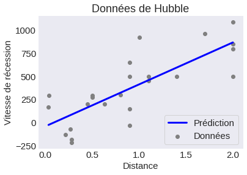

```python
%matplotlib inline
import matplotlib.pyplot as plt
import seaborn as sns
import numpy as np
import pandas as pd
from sklearn.linear_model import LinearRegression
plt.style.use('seaborn-dark')
plt.rcParams.update({ 'font.size' : 15, 'xtick.labelsize':15, 'ytick.labelsize':15 })
```


```python
hubble = pd.read_csv("hubble_data.csv")
```


```python
x = hubble[['distance']]
y = hubble[['recession_velocity']]
```


```python
reg = LinearRegression()
reg.fit(x,y)
```


    LinearRegression(copy_X=True, fit_intercept=True, n_jobs=None, normalize=False)


```python
y_prediction = reg.predict(x)
```


```python
fig = plt.figure()
ax = plt.axes()
plt.scatter(x, y, color='grey', label='Données')
plt.plot(x, y_prediction, color='blue', linewidth=3, label='Prédiction')
ax.set(xlabel="Distance", ylabel="Vitesse de récession")
plt.title("Données de Hubble")
plt.legend(loc='lower right', frameon=True)
```


    <matplotlib.legend.Legend at 0x7f4dc170e610>





```python

```
