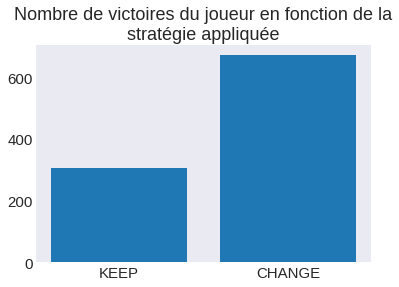
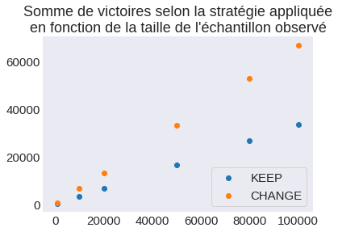

```python
# permet l'affchage des graphiques dans la continuité du code,
# et non dans une fenêtre à part
%matplotlib inline

# importations
import numpy as np
import matplotlib.pyplot as plt
import function as mh
plt.style.use('seaborn-dark')
plt.rcParams.update({ 'font.size' : 15, 'xtick.labelsize':15, 'ytick.labelsize':15 })
```


```python
plt.bar( [1,2], [np.sum(mh.play(mh.Strategy.KEEP, 1000)),
                 np.sum(mh.play(mh.Strategy.CHANGE, 1000))],
        tick_label=["KEEP", "CHANGE"])
plt.title("Nombre de victoires du joueur en fonction de la\nstratégie appliquée")
```


    Text(0.5, 1.0, 'Nombre de victoires du joueur en fonction de la\nstratégie appliquée')





```python
samples = [1000, 10000, 20000, 50000, 80000, 100000]
figure = plt.figure()
plt.scatter(samples, [np.sum(mh.play(mh.Strategy.KEEP, i)) for i in samples], label="KEEP")
plt.scatter(samples, [np.sum(mh.play(mh.Strategy.CHANGE, i)) for i in samples], label="CHANGE")
plt.legend(loc='lower right', frameon=True)
plt.title("Somme de victoires selon la stratégie appliquée\nen fonction de la taille de l'échantillon observé")
```


    Text(0.5, 1.0, "Somme de victoires selon la stratégie appliquée\nen fonction de la taille de l'échantillon observé")





```python

```
